<div align="center">


# Rensi IPTV

**Tus listas IPTV, bien organizadas — míralas en el móvil o envíalas a tu TV.**

[](#-descarga-e-instalaci%C3%B3n)
[](./LICENSE)
[](https://flutter.dev)
[](./CHANGELOG.md)

**Español** · [English](README.en.md)

🌍 Español · English · Português · Français · Deutsch · Русский · Türkçe · العربية · हिन्दी · 中文

</div>

---

Rensi IPTV convierte tu cuenta **Xtream Codes** o tu **lista M3U** en una app de streaming limpia y moderna — la experiencia que esperarías de un servicio de pago, pero gratis, de código abierto y totalmente bajo tu control. Enriquece tus películas y series con carátulas, reparto y sinopsis de **TMDb**, te deja **descargar para ver sin conexión** y —su función insignia— te permite explorar en el móvil y **enviar el contenido a tu Android TV por tu propia red doméstica**, sin cuenta de terceros ni Chromecast.

> **Trae tu propia lista.** Rensi es un *reproductor*. No incluye **ningún canal, stream ni contenido** — tú conectas la cuenta Xtream o la lista M3U que ya tienes. Ver [Aviso legal](#%EF%B8%8F-aviso-legal).

---

## 📸 Capturas

### En el móvil

| Inicio | Explorar | Detalle + reparto |
|:---:|:---:|:---:|
| 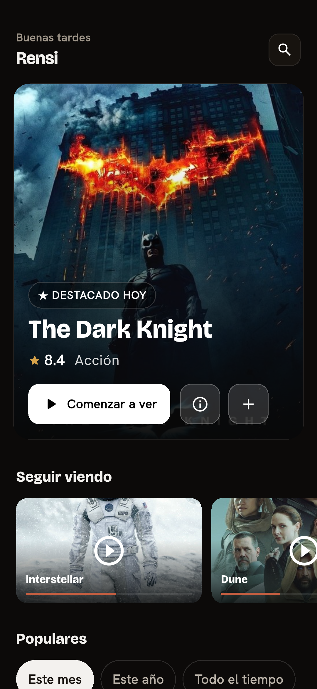 | 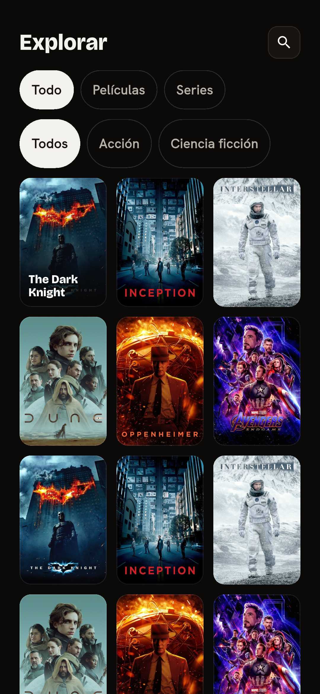 | 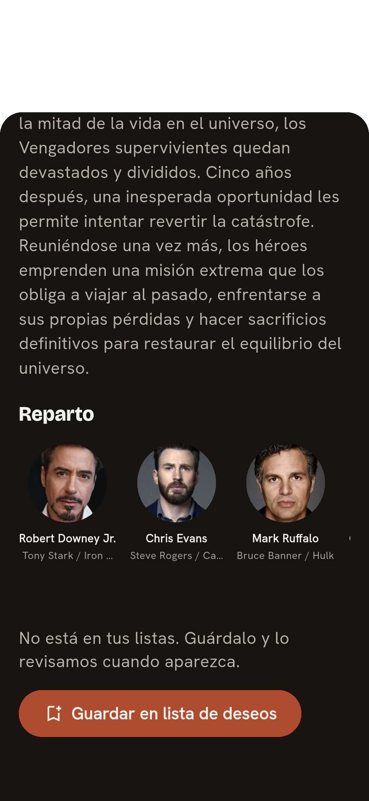 |
| Un inicio personal con banner destacado y carruseles de *Populares* | Filtra por TV en vivo, Películas, Series y género | Sinopsis, valoración y reparto completo de TMDb |

| Reproductor | Descargas offline | Buscar en todo el catálogo |
|:---:|:---:|:---:|
| 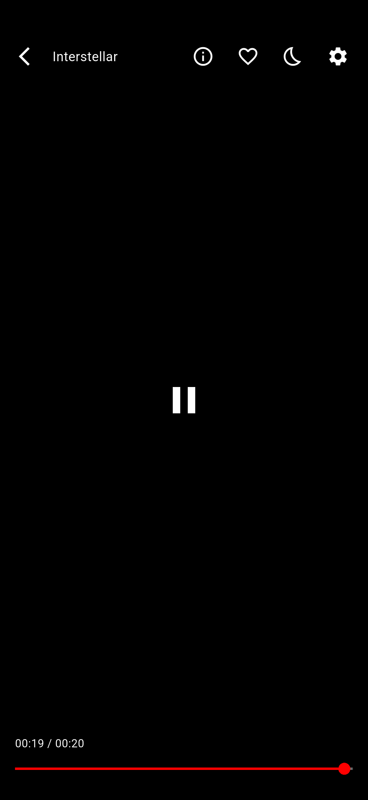 | 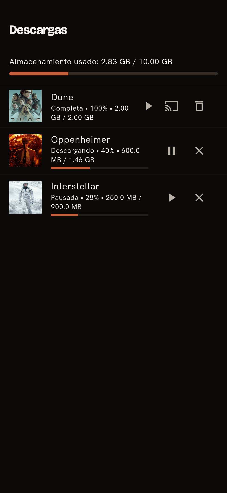 | 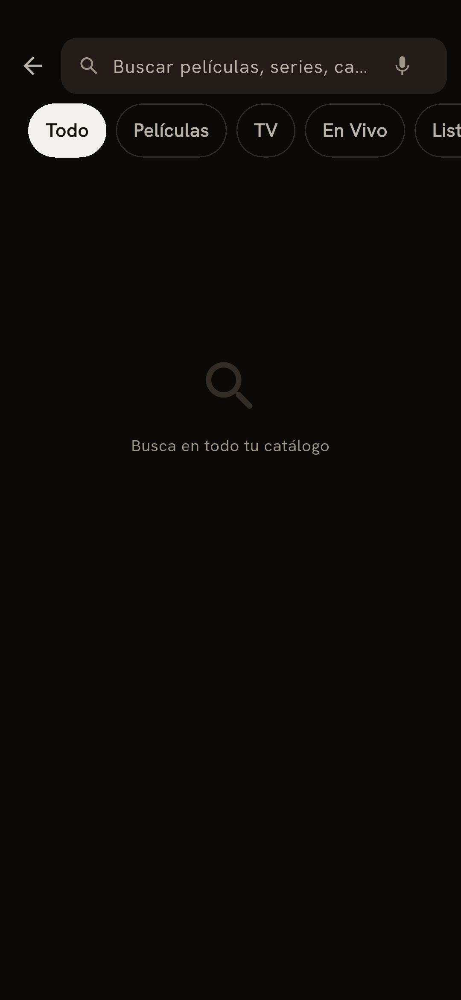 |
| Reproducción acelerada por hardware con pistas de audio y subtítulos | Descarga películas y episodios para verlos sin conexión | Búsqueda global entre todas tus listas |

| Mi lista | Guardar es igual en todo |
|:---:|:---:|
| 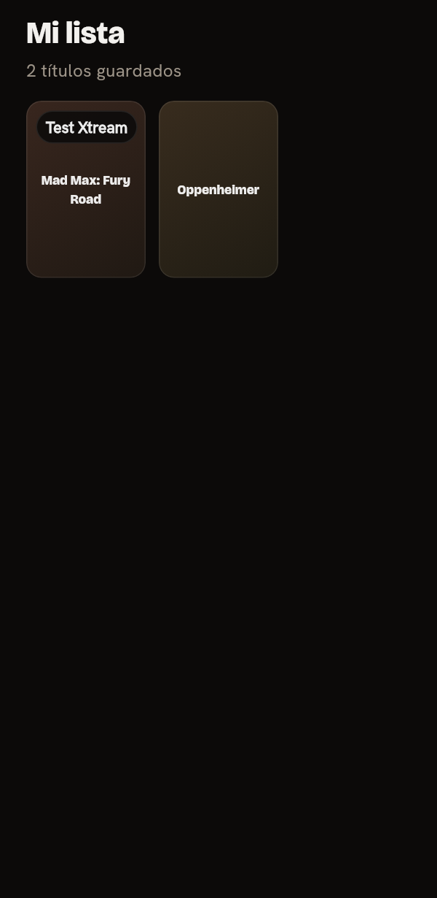 | 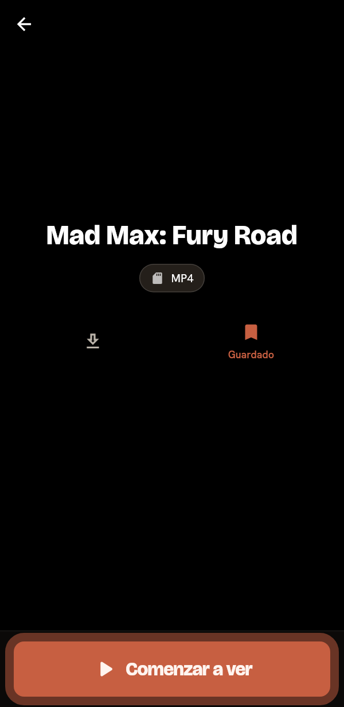 |
| Tus favoritos de **todas** tus listas en una sola vista, marcando de qué lista viene cada uno | Un mismo botón de **marcador** en películas y series, con confirmación |

### Enviar a tu TV

| Control de transmisión (con volumen) | Mini-control persistente |
|:---:|:---:|
| 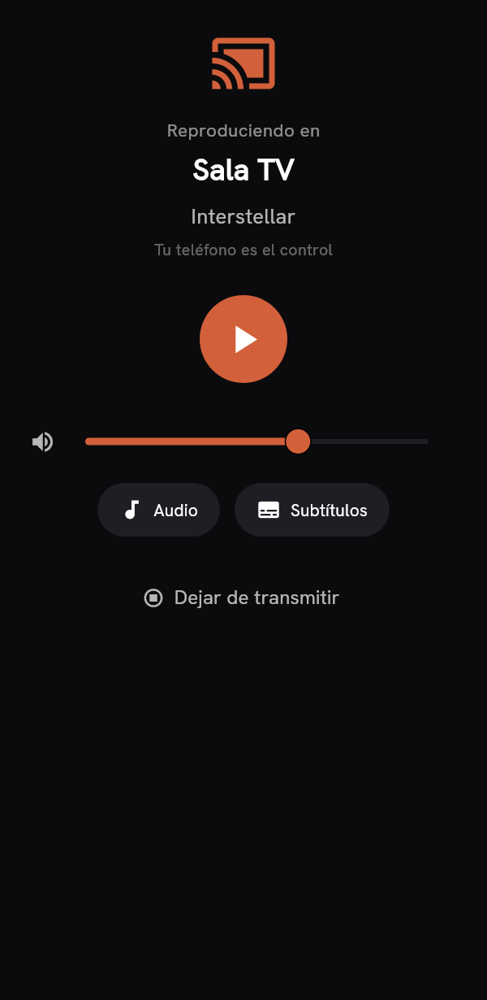 | 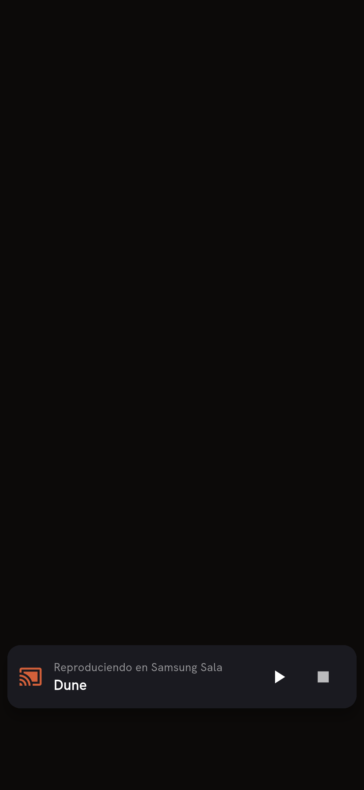 |
| El móvil es el mando: **volumen**, audio, subtítulos y canales | Sigue explorando mientras se reproduce en la TV |

En la propia TV, Rensi funciona como un **receptor** — con el **estado de conexión** visible y el **historial con su carátula**, y reproduce lo que le envíes:

<div align="center">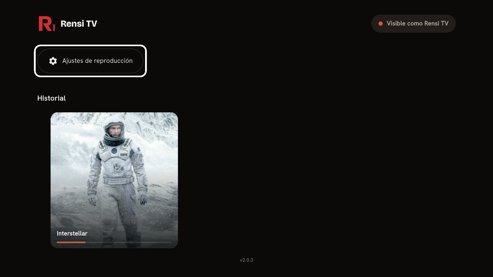</div>

---

## ✨ Funciones

**📺 Mira lo que sea de tus listas**
- Listas **Xtream Codes API** y **M3U / M3U8** (importa desde URL o archivo local)
- **Varias listas** a la vez — cambia de cuenta con un toque
- TV en vivo, Películas y Series, organizadas por categoría
- Reproducción acelerada por hardware (libmpv) con **selección de pista de audio y subtítulos**

**🔎 Descubre, no solo hagas scroll**
- **Enriquecimiento con TMDb** — carátulas, fondos, valoraciones, sinopsis y reparto completo
- **Búsqueda global** en *todas* tus listas a la vez — por título, actor, estudio o género
- **Populares del mes / año / de siempre**, filtrado por género
- **Filmografía del reparto** — toca un actor y ve todo lo suyo que tienes en tu biblioteca
- **Continuar viendo** y **Mi lista** — tus favoritos de **todas tus listas** reunidos en una sola vista

**📲 Envía a tu Android TV — sin Chromecast**
- Una **conexión directa móvil→TV por tu propia red doméstica** — sin nube, sin cuenta de terceros; empareja una vez con un PIN
- El móvil manda: explora, encola, pausa, avanza y **controla el volumen** mientras la TV reproduce
- La TV muestra metadatos ricos —**carátula**, título, sinopsis y reparto, enviados desde el móvil— incluso de un archivo que descargaste sin conexión
- Recuerda las TV emparejadas para reconectar solo

**💾 Llévatelo sin conexión**
- **Descarga** películas y episodios; míralos sin conexión
- Descargas en segundo plano con pausa/reanudar y un medidor de almacenamiento
- Envía un archivo descargado directamente a la TV

**🎨 Hecho para el día a día**
- **10 idiomas**, tema claro y oscuro
- **Copias de seguridad** cifradas y protegidas con contraseña (opcional)
- Credenciales guardadas en el llavero del sistema / `EncryptedSharedPreferences`

### Móvil vs. Android TV

Rensi se diseñó en torno a **una idea: el móvil es el mando, la TV es la pantalla.**

| | 📱 Móvil / Tablet | 📺 Android TV |
|---|:---:|:---:|
| Explorar, buscar y descubrir | ✅ | — |
| Reproducir en el propio dispositivo | ✅ | ✅ |
| Enviar a una TV | ✅ *emisor* | ✅ *receptor* |
| Descargas offline | ✅ | — |
| Reproducir un archivo descargado en la TV | ✅ | ✅ |
| Interfaz de 10 pies con mando D-pad | — | ✅ |

> En la TV, los archivos descargados se reproducen **enviándolos desde el móvil** — la TV no guarda descargas propias.

*(Rensi también compila y corre en escritorio **Linux** como reproductor.)*

---

## 📥 Descarga e instalación

Descarga el **APK** firmado más reciente desde la página de [**Releases**](https://github.com/breisnerlopez/rensi-iptv/releases).

- **📱 Móvil / tablet:** descarga el APK de la arquitectura de tu dispositivo — `rensi-iptv-android-arm64-v8a-<versión>.apk` vale para casi cualquier móvil moderno — y ábrelo. Puede que tengas que permitir "Instalar apps desconocidas" para tu navegador.
- **📺 Android TV:** instala el mismo APK con una herramienta de sideload (p. ej. *Downloader* de AFTVnews, o `adb install`). Rensi se instala como el **receptor + reproductor** en la TV.

> Rensi **aún no está en Google Play.** Las versiones se distribuyen como APK firmados aquí en GitHub.

---

## 🚀 Primeros pasos

1. **Abre la app** y ve a **Añadir lista**.
2. Elige tu fuente:
   - **Xtream Codes** — introduce la URL del servidor, usuario y contraseña, o
   - **M3U** — pega una URL de lista o elige un archivo `.m3u`.
3. Rensi importa y, para películas/series, las **cruza con TMDb** para obtener carátulas y detalles.
4. Explora, busca y dale a reproducir. Eso es todo.

**Para enviar a tu TV:** abre Rensi primero en el Android TV (déjalo en la pantalla de receptor), luego en el móvil toca el icono de **enviar**, elige tu TV e introduce el **PIN** que muestra la TV. Tras el primer emparejamiento reconecta solo.

---

## ❓ Preguntas frecuentes y solución de problemas

- **El móvil no encuentra la TV para enviar.** Ambos dispositivos deben estar en la **misma red Wi-Fi**, y la red tiene que permitir el tráfico local entre dispositivos. Las redes de invitados y los routers con **"aislamiento de AP"** activado bloquean el descubrimiento — desactiva el aislamiento de AP o usa tu red principal.
- **¿Rensi trae canales?** No. Es un reproductor — tú traes tu cuenta Xtream o lista M3U. Ver [Aviso legal](#%EF%B8%8F-aviso-legal).
- **¿Por qué no está en Play Store?** Por ahora, Rensi se distribuye como APK firmados aquí en GitHub.

---

## ⚖️ Aviso legal

Rensi IPTV es un **reproductor multimedia**, en el mismo espíritu que VLC. **No** provee, aloja, incluye ni revende ningún canal de TV, película, serie ni stream, y **no está afiliado a ningún proveedor de IPTV**. Para usarlo debes aportar tu propia cuenta Xtream Codes o lista M3U obtenida legalmente. Eres responsable de asegurarte de tener los derechos sobre el contenido que reproduzcas. Los desarrolladores no asumen responsabilidad por el uso de la app ni por el contenido de terceros al que se acceda a través de ella.

Los metadatos de películas y series (carátulas, reparto, sinopsis) los provee **[The Movie Database (TMDb)](https://www.themoviedb.org/)**. Este producto usa la API de TMDb pero **no está avalado ni certificado por TMDb**.

---

## 🛠️ Tecnología y arquitectura

Rensi es una única base de código Flutter que apunta a Android móvil, Android TV y escritorio.

- **UI:** Flutter (Material 3), sistema tipográfico propio (Bricolage Grotesque / Hanken Grotesk)
- **Reproducción:** [`media_kit`](https://github.com/media-kit/media-kit) → **libmpv** (acelerado por hardware, amplio soporte de códecs)
- **Datos:** [Drift](https://drift.simonbinder.eu/) (SQLite) con migraciones versionadas y transaccionales
- **Metadatos:** API de The Movie Database (TMDb)
- **Descargas:** `background_downloader` (transferencias nativas en segundo plano, pausa/reanudar)
- **Estado / DI:** Provider + `get_it`, un bus de eventos basado en `rxdart`

El **envío a la TV** es un protocolo de segunda pantalla propio, solo por LAN (sin nube, sin Cast Connect):

- **Descubrimiento** vía mDNS/DNS-SD (`bonsoir`) — la TV se anuncia, el móvil la encuentra
- **Canal de control** sobre `wss://` (certificado EC autofirmado generado en runtime, **pineado por huella**)
- **Emparejamiento** con un PIN de 6 dígitos → claves de sesión HKDF/HMAC; **tokens de dispositivo confiable** para que las TV emparejadas reconecten en silencio
- El móvil envía la **URL del contenido + los metadatos de TMDb** en la orden de reproducción, así la TV nunca necesita tus credenciales

---

## 🧑‍💻 Compilar desde el código

Requiere el [SDK de Flutter](https://docs.flutter.dev/get-started/install) (Dart `^3.9.2`).

```bash
git clone https://github.com/breisnerlopez/rensi-iptv.git
cd rensi-iptv
flutter pub get

# Ejecutar en un dispositivo / emulador conectado
flutter run

# Compilar un APK de release (uno por ABI)
flutter build apk --release --split-per-abi
```

---

## 🤝 Contribuir

Se agradecen issues y pull requests. Si reportas un fallo, incluye tu dispositivo/versión de Android y los pasos para reproducirlo — y **nunca pegues tu URL de Xtream, usuario, contraseña ni ningún enlace de lista** en un issue público.

---

## 📜 Créditos y licencia

Rensi IPTV es un **fork** de [Another IPTV Player](https://github.com/bsogulcan/another-iptv-player) de [@bsogulcan](https://github.com/bsogulcan), distribuido bajo licencia MIT. El `LICENSE` original se conserva; las modificaciones y funciones nuevas de este fork también se publican bajo MIT — ver [`LICENSE`](./LICENSE) para el aviso completo de doble copyright.

Metadatos por [TMDb](https://www.themoviedb.org/). Reproducción por [media_kit](https://github.com/media-kit/media-kit) / [mpv](https://mpv.io/).

**MIT** — ver [`LICENSE`](./LICENSE).
